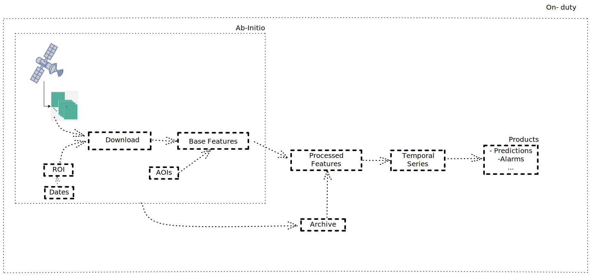
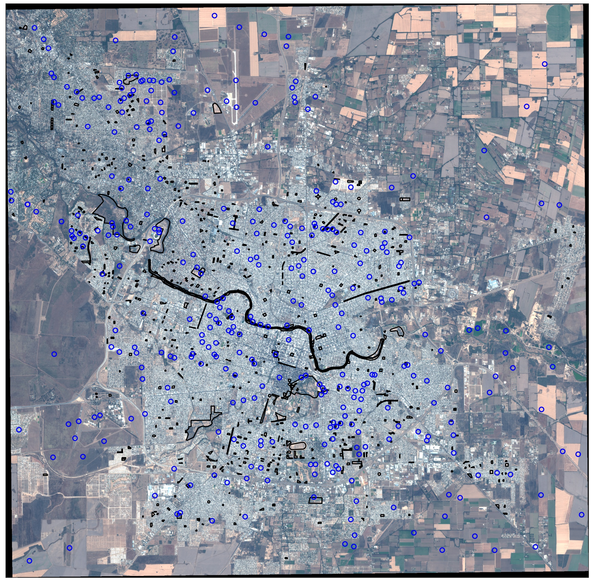

# Monitoreo de Espacios Verdes - DiploDatos FaMAF 202X

## Objetivos

Buscamos monitorear de una forma automatizada ciertos parámetros 
relacionados a espacios verdes de distintos puntos del país. Si bien el 
enfoque actual (y los datos) están orientados a plazas, parques etc, esto 
no conlleva una limitación para la propuesta de trabajo. Es decir, se 
podría monitorear cualquier zona de interés cuyo comportamiento estacional
sea susceptible de ser descripto por las técnicas estándar de series temporales.

Particularmente vamos a estar trabajando con Imágenes Satelitales (o productos derivados de ellas) de libre acceso (Sentinel 2).

Sumamos a esta propuesta de monitoreo ciertas etapas/estados que forman parte
de un ciclo usual de desarrollo en Ciencia de Datos.

### Análisis y Visualización de Datos

Trabajar con imágenes satelitales implica incorporar conceptos tales como
rasters, resolución, bandas, proyecciones,etc. Para su visualización o representación existen diferentes formas que pueden brindar una mejor interpretación de las mismas (cuando queremos resaltar algo en particular por ejemplo).
Adicionalmente al trabajo con rasters (en forma simplificada un raster es una grilla de puntos cada uno de los cuales tiene alguna clase de identificación geográfica, que nos permite ubicarlos en el espacio) le sumamos ciertas representaciones geométricas, lineas, puntos polígonos (también asociados a cierta clase de referencia geométrica) que nos permiten marcar sobre un raster ciertas zonas de interés por ejemplo.

- **notebook asociada: Analisis-y-Visualizacion-MEV**
    - [local](./notebooks-tp/Analisis-y-Visualizacion-MEV-TP.ipynb)
    - [colab](https://colab.research.google.com/drive/1ng4nQs86cx_qK0C0BJwkSsKQ9YVrqVoz#scrollTo=YvZeor7MOwoL)

### Análisis Exploratorio y Curación de Datos

¿Todos los datos nos sirven? Las imágenes satelitales como toda otra imagen tienen
diferentes factores que las pueden "ensuciar". Para las imágenes en cuestión, tales
factores pueden ser:
- nubes (con esta vamos a estar trabajando particularmente)
- falta de luminosidad
- defectos del sensor
- etc.

Independiente del estado de la imagen, siempre podemos extraer datos, calcular indices (combinación de las bandas de un dado raster), etc. Sin embargo estos serán buenos si la imagen de la cual proceden lo era.
En esta etapa de "conocer" y "curar" los datos vamos a estar interesados en descartar aquellos datos o conjuntos de datos que se desvíen o no aporten información suficiente para los análisis posteriores.

- **notebook asociada: WIP**

### Aprendizaje Supervisado

Si tenemos los datos (rasters) y las zonas de interés con su etiqueta correspondiente (vectores, shp files, etc) es decir, en suma,  la clasificación de un cierto conjunto de datos, podemos generar algunos clasificadores supervisados y analizar para el problema:

- ¿Es suficiente un solo modelo?
- ¿Que tan importante es la parte temporal? ¿Necesitamos que sea estacional?
- ¿Es necesario utilizar todas las bandas del raster o con ciertos indices es suficiente?
- ¿Podríamos utilizar los modelos para detectar alguna clase de anomalía en el comportamiento de una dada región?
- etc

- **notebook asociada: WIP**

### Aprendizaje No Supervisado

Si tenemos los datos (rasters) y las zonas de interés con su etiqueta (pero por alguna razón no queremos utilizarlas). ¿Existe alguna forma que nos permite recuperar zonas diferenciadas dentro del area de monitoreo? (por zona diferenciada nos referimos a sectores que naturalmente se separan por su firma espectral). 
- ¿Podríamos utilizar este enfoque para complementar/ayudar en el proceso de etiquetado?
- ¿Este esquema no supervisado podría servir para cotejar resultados supervisados?
- ¿Existe alguna forma de ayudar a que las _zonas diferenciadas_ emerjan en una forma mas accesible (ayuda: pensar en indices, NDWI, NDVI,etc).
- ¿Que tan importante es la preparación de los datos para que el esquema no supervisado pueda ser efectivo?
- etc
 
 - **notebook asociada: WIP**

### Aplicación: Monitoreo - Series Temporales

La idea consiste en caracterizar via algún estadístico/indice/etc el conjunto de 
puntos abarcado por cada parche para cada fecha disponible. El tamaño de cada parche 
es arbitrario asi como los estadísticos elegidos. Esto permite la construcción de una serie temporal para cada parche, la cual se analizará con las herramientas correspondientes. 
Generar las series temporales involucra (ver siguiente figura): 
- recolección de datos históricos (ab-initio) y armado de la serie base
- actualización de la serie base (en-regimen)




- **notebook asociada: [espacios-verdes-st](/notebooks/ab-initio-mev-cba-4.ipynb)**

## Datos


### Zonas de Interés (Vector Files)

El conjunto de datos ROI (ROI- region of interest) se los obtuvo de

[atlas-espacios-verdes](https://github.com/bitsandbricks/atlas_espacios_verdes)

Los mismos se corresponden con parques, plazas y zonas verdes de las distintas ciudades capital del país. Estos datos fueron colectados y procesados con el fin de poder contribuir en la competencia generada por la fundación [Bunge & Born](https://www.fundacionbyb.org/atlas-espacios-verdes-argentina)


### Rasters, Indices, etc (WIP)

La construcción del conjunto de datos (bandas, indices, etc) sobre cada zona de interés para distintas fechas se puede consultar en [dataset-build](data/ab-initio-dataset-build.md).

#### Datos Pre-Procesados

El conjunto de datos procesados corresponde a todos aquellos circunscriptos bajo el [AOI de cordoba](./data/cba/cordoba.geojson) (en lineas rojas la pisada del satélite y en azul la ciudad de Córdoba).
 

La sección (parche azul) ampliada luce (para una fecha determinada):


Una muestra de los datos pre-procesados se pueden observar en  [sample-datos](data/cba/espacios-verdes-dataset-sample.csv).

El conjunto de imágenes utilizadas se puede encontrar en:
- descargadas: revisar [dataset-build](data/ab-initio-dataset-build.md) en #_Imágenes-Cba_
- procesadas: revisar [dataset-build](data/ab-initio-dataset-build.md) en #_Imágenes-Cba_

__NOTA__: Las imágenes crudas no están disponibles en los links anteriores, pero si es posible descargarlas utilizando el primero de ellos y utilizando alguna de las apis mencionadas en [ab-initio-mev-cba-1](./ab-initio-mev-cba-1.ipynb)

El conjunto de datos pre-procesados se pueden consultar en:
- [dataset-build](data/ab-initio-dataset-build.md)

__Espacios No verdes__

Para la etapa de clasificación adicionamos un conjunto de datos que corresponden a zonas consideradas "NO espacio verde" o no se encuentran (en forma total) enmarcadas en el atlas mencionado en [atlas-espacios-verdes](https://github.com/bitsandbricks/atlas_espacios_verdes).




#### Estructura de los datos pre-procesados

La estructura de los datos se pueden consultar en:
- [datos pre-procesados](./data/estructura-datos.md) 

#### Parches

Adicionalmente ponemos a disposición al menos 12 parches (1 por mes) de la ciudad de Cordoba:
- parches: revisar [dataset-build](data/ab-initio-dataset-build.md)

Por parches nos referimos al stack o apilamiento de bandas de una imagen satelital.


## Ambiente

### Conda

Proveemos un archivo de configuración _yml_ para especificar un ambiente conda.

``` conda create -f environment-no-builds.yml ``` 

_environment.yml_ se genero usando un SO Ubuntu 20.04 (no-build intenta evitar cuestiones especificas y por eso se sugiere utilizar ese para cualquier SO).