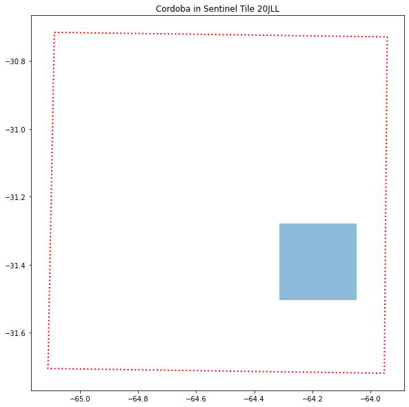

# Construcción del Dataset (Raster-Side)

## Metodología

La metodología propuesta supone la descarga de las imágenes completas. Existen alternativas como el procesamiento
via secciones o usando COG (Cloud optimized Geotiff) que son completamente viables y no invalidan el proceso
descripto a continuación.

### Ab-initio (Al inicio)

- Se descarga el conjunto total de imágenes para un dato lapso temporal (con ciertos criterios para la parte de nubes) 
se genera un recorte sobre la zona de interés (supongamos una ciudad)

- El parche obtenido se genera con un cierto numero de bandas y se archiva.
	- Las bandas que se utilizan se definen a priori y no son modificables (al menos fácilmente) una vez comenzado el flujo de procesamiento. La resolución es la nativa o la mayor posible (estamos pensando en Sentinel 2 a 10 m). En 
	aquellos casos que la banda tenga menor resolución se resamplea a la mayor consistente con el resto de las bandas.

- Dado un parche (y fecha)
	- calculamos los indices para cada uno de los ROIs dentro de la zona general
	- unimos el conjunto de datos
	- seguimos con la fecha siguiente
	
Esto nos permite construir una serie temporal para cada roi (dentro de una zona de interés), la cual sera analizada y caracterizada para su posterior uso. Esta caracterización permitirá generar el forecasting o predicción de comportamiento.

#### Análisis - Extra

El análisis inicial o exploración contempla la selección de aquellos indices que o 
"features" que nos van a permitir describir de manera mas realista el proceso que intentamos monitorear.

### On-Duty (En regimen)

- Descarga de zona de interés (en cuasi-tiempo real)
- Obtener los indices de los ROIs dentro de la zona de interés ( por rois dentro de la zona de interés nos estamos refiriendo a cada parque, plaza, etc dentro de una ciudad por ejemplo)
- Fusionar los datos con el set histórico
- Generar la predicción y comparar el comportamiento.
- Generar las alarmas y acciones cuando (bajo cierto criterio) el comportamiento no sea el esperado.

### Información Respecto a Procesados

- El conjunto de datos procesados corresponde a todos aquellos circunscriptos bajo el [AOI de cordoba](./cba/cordoba.geojson).
 
 en  lineas rojas la imagen satelital (pisada del satelite) y en azul el aoi de Córdoba

- Una muestra de los datos procesados se pueden observar en:
	- [sample-datos](cba/espacios-verdes-dataset-sample.csv)

- Los datos pre-procesados entre 2017 y 2021 se pueden consultar en:
	- [datos-preprocesados  2017-2021](https://drive.google.com/file/d/1gtfqdI1TAZaQ4QAC3y3E8Qokzj3_keI3/view?usp=sharing) (csv comprimido en zip)

- Los datos procesados entre 2017 y 2022 se pueden consultar en:
	- LINK WIP

### Imágenes - CBA

El conjunto de imágenes utilizadas se puede encontrar en:

- descargadas: [imágenes-descargadas](cba/productos-descargados-cba.cvs)
- procesadas: WIP

Teniendo el product-id es posible descargarlas utilizando algunas de las apis al respecto.

__NOTA__: Las imágenes crudas no están disponibles en los links anteriores, pero si es posible descargarlas utilizando el primero de ellos y utilizando alguna de las apis mencionadas en [ab-initio-mev-cba-1](../notebooks/ab-initio-mev-cba-1.ipynb)

## Notebooks

La metodología descripta se puede observar en las jupyter-notebooks:

- [ab-initio-mev-cba-0](../notebooks/ab-initio-mev-cba-0.ipynb): identificación de zona de interés y espacios verdes

- [ab-initio-mev-cba-1](../notebooks/ab-initio-mev-cba-1.ipynb): identificación de Tile (imagen satelital) y descarga.

- [ab-initio-mev-cba-2](../notebooks/ab-initio-mev-cba-2.ipynb): extracción de estadísticos de bandas y cálculos de indice (ejemplo en 1 imagen).

- [ab-initio-mev-cba-3](../notebooks/ab-initio-mev-cba-3.ipynb): procesado del conjunto total de imágenes y generacion del [dataset](./estructura-datos.md)

- [ab-initio-mev-cba-4](../notebooks/ab-initio-mev-cba-4.ipynb): muestra conceptual de series temporales para un cierto conjunto de datos y espacio verde.