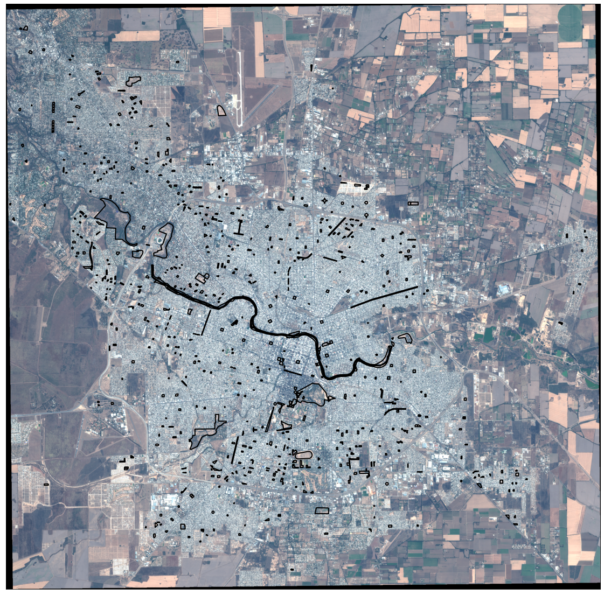
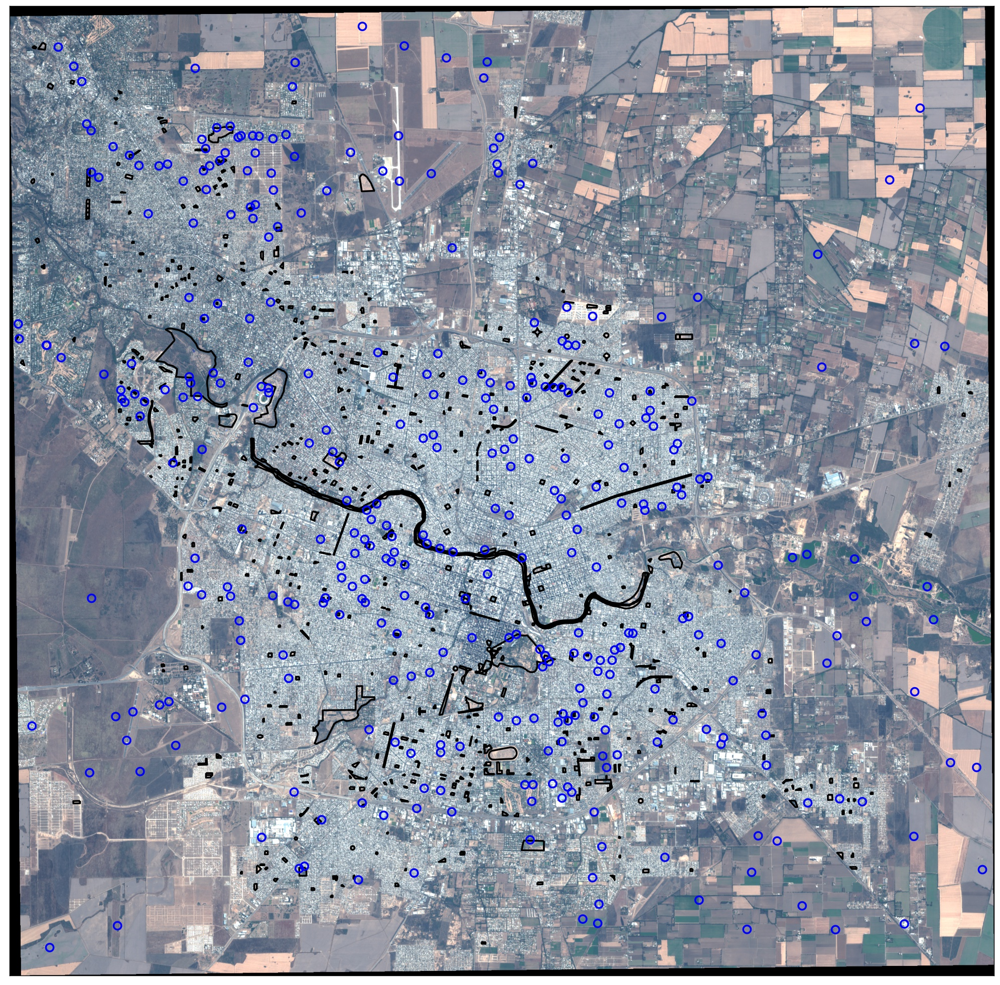

# Estructura datos

El conjunto de datos pre-procesados tienen un formato tabular.
Los mismos se corresponden con diferentes estadísticos o propiedades extraídas desde el conjunto de rasters (parches):

- {B0i/indice}_{min,max,mean,median,nodata,range,count}:
    - min: valor mínimo alcanzado por la Banda o indice en la zona de interés.
    - max: valor máximo alcanzado por la Banda o indice en la zona de interés.
    - median: mediana alcanzada por la Banda o indice en la zona de interés.
    - nodata: cantidad de valores nulos en la Banda o indice en la zona de interés.
    - range: rango de los valores alcanzado por la Banda o indice en la zona de interés.
    - count: cantidad de valores en la zona de interés (count + nodata son la cantidad total de pixeles de un dado espacio verde)
- raster: raster del cual se extraen los estadísticos
- clouds_on_raster: nubosidad del raster completo
- osm_id: identificador asociado a la capa original ([atlas-espacios-verdes](https://github.com/bitsandbricks/atlas_espacios_verdes))
- name: nombre del espacio ( si es que lo tiene, por ejemplo, _Parque Sarmiento_).
- area_m2: area en metros cuadrados
- date: fecha de la muestra.
- desc: ['Barrio','Barrio+Espacio-Verde','Campo','Indefinido'] __NOTA__: Solo en dataset Espacios NO verdes.

Es decir para zona de interés (espacio verde y zona No verde) comprendido en la ciudad de cordoba (y para cada fecha disponible) se computa las magnitudes mencionadas.

Por espacio verde nos referimos a cada uno de los polígonos en negro en la figura anterior.

Por espacio NO verde nos referimos a cada uno de los polígonos en azul de la figura siguiente:

